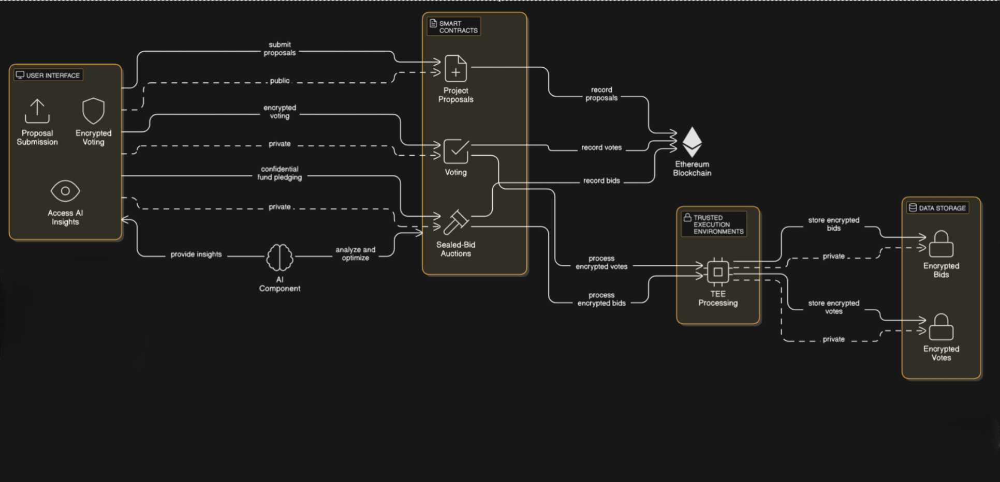

# AISecureFundDAO (ASFD)

is an innovative Decentralized Autonomous Organization (DAO) that combines private voting and sealed-bid auctions on the Ethereum blockchain. By leveraging Trusted Execution Environments (TEEs) and artificial intelligence (AI), it ensures privacy-preserving governance and optimized funding allocation. This project tackles challenges in traditional DAOs, such as lack of privacy and susceptibility to manipulation, making it ideal for applications like research funding, grant distribution, and community treasury management.

## Architecture Diagram



## 🌟 Features & Benefits

- **Privacy-Preserving Governance**: Votes and funding pledges remain confidential using TEEs until results are finalized, ensuring fairness and preventing manipulation.
- **Unified Decision-Making**: Integrates voting and funding into a single process, aligning governance with financial commitment.
- **AI-Enhanced Optimization**: AI analyzes voting patterns and optimizes funding distributions while preserving privacy.
- **Manipulation Prevention**: Eliminates risks like vote buying and strategic voting through secure, private mechanisms.
- **Sponsor Integrations**: Incorporates advanced technologies from sponsors like Marlin TEEs, Nethermind, Nillion, t1 Protocol, Autonome, 0G, and Coinbase AgentKit for enhanced functionality and security.

## Potential Applications

- Research and development funding
- Grant distribution for emerging technologies
- Community treasury management
- Investment decisions in sensitive markets
- Public goods funding

## 🏗️ Architecture & Components

AISecureFundDAO is built on a modular architecture integrating Ethereum smart contracts, TEEs, AI, and sponsor technologies:

- **Smart Contracts**: Handle project proposals, private voting, sealed-bid auctions, result verification, and treasury operations.
- **Trusted Execution Environments (TEEs)**: Process votes and bids securely, maintaining confidentiality.
- **AI Components**: Analyze data and optimize funding allocations using privacy-preserving techniques.
- **Sponsor Integrations**: Enhance the platform with real-time proving, decentralized storage, AI agents, and more.

### Core Components

- `ProjectRegistry.sol`: Manages project submissions and metadata.
- `PrivateVoting.sol`: Processes encrypted votes via TEEs.
- `SealedBidAuction.sol`: Handles confidential funding pledges.
- `ResultVerification.sol`: Verifies TEE computation outcomes.
- `Treasury.sol`: Distributes funds based on voting and auction results.

For a detailed breakdown, see the architecture documentation (`./docs/architecture.md`).

## 🚀 Installation & Setup

### Prerequisites

- Node.js (v16+)
- Python (v3.8+)
- Git
- Hardhat (for smart contract development)
- Docker (optional, for TEE setup)

### Clone the Repository

```bash
git clone https://github.com/mrarejimmyz/AISecureFundDAO_EthGlobal.git
cd AISecureFundDAO_EthGlobal
```

### Install Dependencies

Frontend:

```bash
cd frontend
npm install
```

Backend (Python):

```bash
pip install -r requirements.txt
```

### Configure Environment Variables

Create a `.env` file in the root directory and add API keys or settings for sponsor integrations (e.g., Marlin TEEs, Nillion).

### Deploy Smart Contracts

Deploy to a testnet (e.g., Sepolia) using Hardhat:

```bash
npx hardhat run scripts/deploy.py --network sepolia
```

### Run the Frontend

```bash
cd frontend
npm start
```

## 🛠️ Usage

1. **Submit a Project Proposal**:

   - Use the frontend to submit a project for funding consideration.

2. **Cast Votes and Pledge Funds**:

   - Participate in private voting and sealed-bid auctions to support projects.

3. **View Results**:
   - After the voting/pledging period, results are revealed, and funds are distributed.

Check out the usage guide (`./docs/usage.md`) or demo video (link-to-video) for a detailed walkthrough.

## 🧪 Testing

**Unit Tests**:

- Smart Contracts: `npx hardhat test`
- TEE Components: `python tests/unit/tee/test_tee.py`
- AI Modules: `python tests/unit/ai/test_ai.py`

**Integration Tests**:

- Run end-to-end tests: `python tests/integration/end_to_end_tests.py`

Ensure all tests pass before deployment or contributions.

## 🤝 Contributing

We welcome contributions to improve AISecureFundDAO! To get involved:

- Report issues or suggest features via GitHub Issues.
- Submit pull requests with enhancements or fixes.
- Follow our coding standards (`./docs/coding_standards.md`).

### Areas for Help

- Enhancing AI optimization algorithms
- Improving frontend UX
- Expanding sponsor integrations

## 🙏 Acknowledgments

Thanks to our sponsors and the technologies powering this project:

- **Marlin TEEs**: Secure computation
- **Nethermind**: Agentic AI capabilities
- **Nillion**: Privacy-preserving AI
- **t1 Protocol**: Real-time proving
- **Autonome**: AI agent development
- **0G**: Decentralized storage
- **Coinbase AgentKit**: Wallet management

Gratitude also goes to the open-source community and tools that supported our work.

## 📬 Contact & Resources

- **Documentation**: See the docs (`./docs/`) folder for detailed guides.
- **Questions?**: Reach out via GitHub Discussions or email [mrarejimmy@jimpsons.org](mailto:mrarejimmy@jimpsons.org).

---

AISecureFundDAO redefines decentralized governance and funding by balancing transparency and privacy. Join us in building the future of secure, optimized decision-making!
